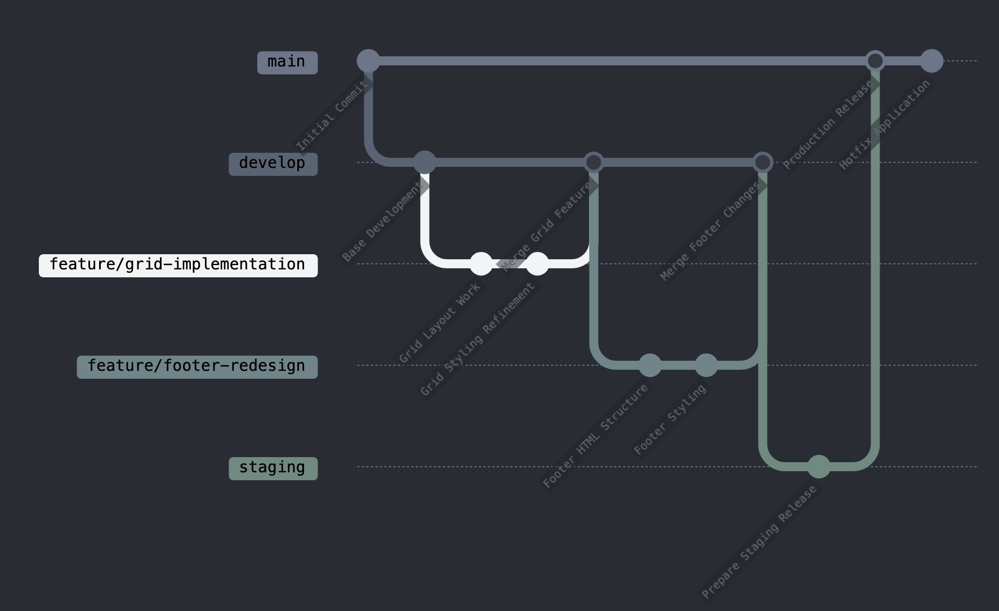

  

[開発用AI：https://claude.ai/chat/fc16e1e5-e773-438e-a64d-3c2cdd2386c6](https://claude.ai/chat/fc16e1e5-e773-438e-a64d-3c2cdd2386c6)
## エラー状況
- デプロイ時にanzza-home-staging1バケットが強制的に使用されている
.cache/s3.config.jsonを適当に編集すること

# ANZZAウェブサイトプロジェクト

## プロジェクト概要
ANZZAのブランドの独自の職人技とデジタルプレゼンスを showcaseするGatsbyベースのウェブサイトです。

## ブランチ戦略

<!-- Start Generation Here -->

  

<!-- End Generation Here -->

### 現在のブランチ構成
- `main`: 本番環境用の安定版
- `develop`: メインの開発ブランチ
- `staging`: 本番前最終テスト用
- `その他`: レガシーブランチ（参照用）

### ブランチワークフロー

#### ブランチの種類
1. **メインブランチ**
   - `main`: 現在の本番環境を表す
   - `develop`: 継続的な開発を行う中心的なブランチ
   - `staging`: 本番リリース前の準備と最終テスト用

2. **フィーチャーブランチ**
   - 命名規則: `feature/[簡潔な説明]`
   - 例: `feature/grid-implementation`、`feature/footer-redesign`
   - 特定の機能や改善のために使用
   - 常に`develop`ブランチから分岐し、`develop`にマージ戻す

#### ワークフロープロセス
1. `develop`ブランチから新しい機能のブランチを作成
2. 特定の作業用にフィーチャーブランチを作成
3. 変更の開発とコミット
4. `develop`へのマージ用プルリクエストを開く
5. コードレビューと検証
6. 承認後に`develop`にマージ
7. 定期的に`develop`を`staging`にマージしてテスト
8. 本番準備ができたら`main`にリリース

#### レガシーブランチ
- `2020-mode`: 保持